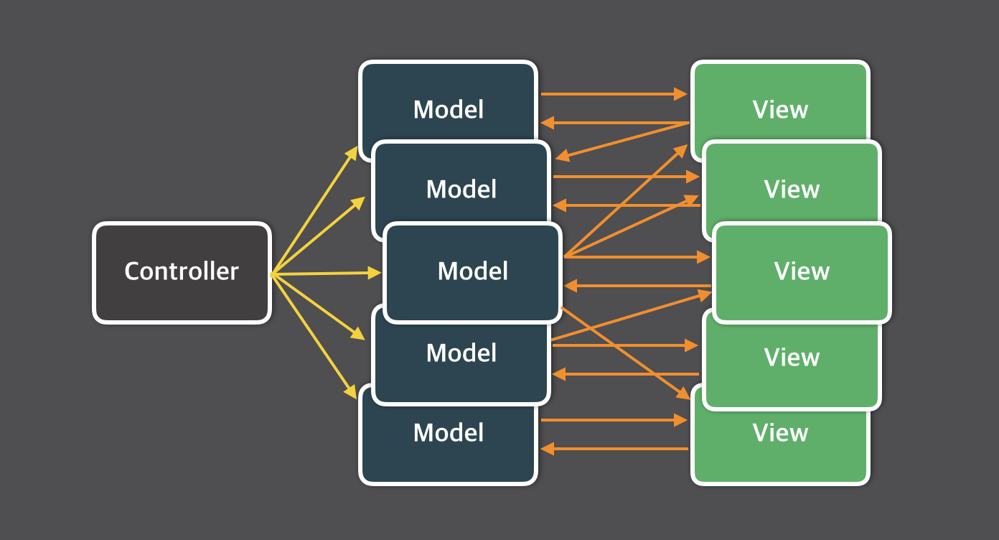
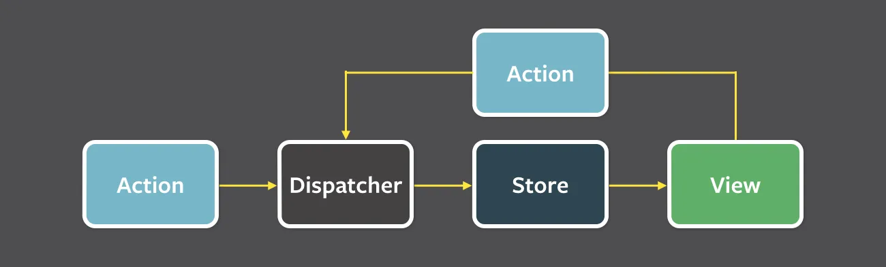

# 05장: 리액트와 상태 관리 라이브러리

## 5.1 상태 관리는 왜 필요한가?

사실 상태를 관리하는 것 -> 손이 많이갈 뿐 어렵지 않음

하지만 어플리케이션 전체적으로 관리해야할 상태가 있다고 가정하면

- 상태에 따라 각 상태에 맞는 UI를 보여줘야 함
- 상태 어디에 저장할지 문제 / 유효 범위 / 자식 상태 변화 어떻게 감지할지

따끈 따근 머리가 아프고

- 상태 변화가 일어남에 따라 tearing 현상을 방지해야 함.

### 5.1.1 리액트 상태 관리의 역사

- 앵귤러와는 다르게, 리액트 = 라이브러리임 그 이상의 기능 제공 x
- 따라서 상태 관리 방법 개발자에 따라 시간에 따라 다르다. 역사를 봅시다

#### Flux 패턴의 등장

> 상태와 상태의 변경에 대한 흐름과 방식을 단방향으로 채택한 것이 특징

- 순수 리액트에서 할 수 있는 상태관리 = Context API를 떠올릴 것

  - but 엄밀히 말하면 Context API는 상태관리 x 상태 주입을 도와줌
  - 리액트에서 Context API를 선보인 것 16.3버전 / useContext는 16.8버전
  - 리덕스 나타나기전까지 딱히 별 것 없었음

- 2014년 Flux 패턴과 함께 이를 기반으로 한 라이브러리 Flux를 소개하게 됨.
- 당시 웹 개발 상황

  - 웹 어플리케이션 = 비대해짐, 상태 많아짐

    ⇒ 어떤 일이 일어나서 어떤 상태가 변했는 지 추적 어려움

    

  - 기존의 MVC 패턴은 모델과 뷰가 많아질수록 복잡도가 증가
  - 페이스북 팀은 이러한 문제의 원인을 **양방향 데이터 바인딩**으로 보았다.

**양방향 데이터 바인딩**

- 뷰가 모델을 변경할 수 있으며 모델도 뷰를 변경할 수 있음.
- 코드를 작성하는 입장에서는 간단할 수 있음
- but 코드의 양 많아지고 변경 시나리오가 복잡해질수록 관리가 어려워짐

페이스북팀은 단방향으로 데이터 흐름을 변경하는 것을 제안

그것이 **Flux 패턴**의 시작


**Action:** 어떠한 작업을 처리할 액션과 그 액션 발생 시 함께 포함시킬 데이터를 의미. 액션 타입과 데이터를 각각 정의해 이를 디스패처로 보낸다.

```tsx
type Action = { type: add; payload: number };
```

- 어떤 종류의 액션이 있고, 어떤 데이터를 필요로 하는 지 정의

**Dispatcher:** 액션을 스토어에 보내는 역할. 콜백 함수 형태로 앞서 액션이 정의한 타입과 데이터를 모두 스토어에 보낸다.

```tsx
아래 코드에서 dispatcher가 dispatcher의 역할
```

**Store:** 여기에서 실제 상태에 따른 값과 상태를 변경할 수 있는 메서드를 가지고 있다. 액션의 타입에 따라 어떻게 이를 변경할지가 정의돼 있다.

```tsx
function reducer(prevState: StoreState, action: Actioon) {
	counst { type: ActionType } = action
	if (ActionType === 'add') {
		return { count: prevState.count + action.payload }
	}

	throw new Error(`Unexpected Action [${ActionType}]`)
}
```

```tsx
export default function App() {
	const [state, dispatcher] = useReducer(reducer, {count: 0})

	function handleClick() {
		dispatcher({type: 'add', payload: 1}
	}

	return (
		<div>
			<h1>{state.count}</h1>
			<button onClick={handleClick}>+</button>
		</div>
	)
}
```

- reducer와 useReducer가 store의 역할
- 각각 현재 상태와 상태에 따른 값이 어떻게 변경되는지를 정의
- dispatcher로 액션 실행 이것을 View인 App 컴포넌트에서 보여줌.

**View:** 리액트의 컴포넌트에 해당하는 부분으로 스토어에서 만들어진 데이터를 가져와 화면을 렌더링하는 역할.



- 뷰에서도 사용자의 입력이나 행위 따위에 따라 상태를 업데이트하고자 할 수 있음. 이 경우에는 다음 그림처럼 뷰에서 액션을 호출하는 구조로 구성됨.

**`전체 예시 코드`**

```tsx
type StoreState = {
	count: number
}

type Action = { type: add; payload: number}

function reducer(prevState: StoreState, action: Actioon) {
	counst { type: ActionType } = action
	if (ActionType === 'add') {
		return { count: prevState.count + action.payload }
	}

	throw new Error(`Unexpected Action [${ActionType}]`)
}

export default function App() {
	const [state, dispatcher] = useReducer(reducer, {count: 0})

	function handleClick() {
		dispatcher({type: 'add', payload: 1}
	}

	return (
		<div>
			<h1>{state.count}</h1>
			<button onClick={handleClick}>+</button>
		</div>
	)
}
```

- 이러한 단방향 데이터 흐름 방식은 당연히 불편함도 존재
  - 사용자의 입력에 따라(여기서는 클릭에 따라) 데이터를 갱신하고 화면을 어떻게 업데이트해야 하는지도 코드로 작성해야 하므로 코드의 양이 많아지고 개발자도 수고로워진다.
  - 그러나 데이터의 흐름은 모두 애션이라는 한 방향(단방향)으로 줄어듦으로 데이터의 흐름을 추적하기도 쉽고 코드를 이해하기가 한결 수월해진다.
- 리액트는 대표적인 단방향 데이터 바인딩을 기반으로 한 라이브러리였으므로 이러한 단방향 흐름을 정의하는 Flux 패턴과 궁합이 잘 맞았다. 이와 동시에 Flux 패턴을 따르는 다양한 라이브러리들이 우후죽순처럼 등장하기 시작했다

- 대표적인 라이브러리
  1. Flux
  2. alt
  3. RefluxJs
  4. NuclearJS
  5. Fluxible
  6. Fluxxor

#### 리덕스의 등장

- 최초에는 Flux 구조를 구현하기 위해 만들어진 라이브러리 중 하나였음
- 한가지 더 특별한 것 = Elm 아키텍처 도입

  - Elm이란?

    - 웹페이지를 선언적으로 작성하기 위한 언어

      - model, update, view에 주목
        - 모델(model): 애플리케이션의 상태를 의미. 여기서는 Model을 의미하며, 초기값으로는 0이 주어졌다
        - 뷰(view): 모델을 표현하는 HTML을 말한다. 여기서는 Model을 인수로 받아서 HTML을 표현한다.
        - 업데이트(update): 모델을 수정하는 방식을 말한다. Increment, Decrement를 선언해 각각의 방식이 어떻게 모델을 수정하는 지 나타냈다.
          Elm은 Flux와 마찬가지로 데이터 흐름을 세 가지로 분류하고, 이를 단방향으로 강제해 웹 애플리케이션의 상태를 안정적으로 관리하고자 노력
          리덕스는 Elm 아키텍처의 영향을 받음

- 진짜 훌륭
- but 상태 하나 만들려고 보일러플레이트 겁나게 만들어야 함. → 지금은 간소화 됨.

#### context API와 useContext

프롭스 드릴링 → context api 출시

context api를 사용하면 → context provider가 상태를 주입하여 사용가능해짐.

16.3 이전 버전에서도 사실 context 있었음. → **`getChildContext()`**를 제공

but 상위 컴포넌트가 렌더링되면서 getChildContext가 호출됨가 동시에 → 불필요한 렌더링

컴포넌트의 결합도가 높아지는 등의 단점

16.3버전에서의 context → 우리가 아는 context api

- 자식의 자식까지도 props 넘겨주기 쌉가능

#### 훅의 탄생, 그리고 React Query와 SWR

Context API가 선보인지 1년이 채 되지 않아 리액트는 16.8버전에서 함수 컴포넌트에 사용할 수 있는 다양한 훅 API가 추가됨. 훅 API는 기존의 무상태 컴포넌트를 선언하기 위해서만 제한적으로 사용됐던 함수 컴포넌트가 클래스 이상의 인기를 구가할 수 있도록 많은 기능을 제공했다.

이 중 가장 큰 변경점 → state

다들 자기만의 훅 만들기 바쁨→

이때 React Query와 SWR 등장 ㅜㄷ두둥장

- fetch를 관리하는 데 특화된 라이브러리
- HTTP 요청 특화 상태 관리 라이브러리

재요청 시 → 캐시 값 활용

#### Recoil, Zustand, Jotai, Valtio까지

SWR과 React Query가 HTTP 요청에 대해서만 쓸 수 있다면 → 좀 더 범용적인 것

페이스북에서 만든 Recoil를 필두로, \*\*\*\*Zustand, Jotai, Valtio 등등 있음

- 과거 리액트 리덕스에 의존 (거의 업계 표준)
- 현재는 점차 다양한 방법 등장 → 다른 상태 관리 라이브러리 선택

## 5.2 리액트 훅으로 시작하는 상태 관리

리액트 16.8에서 등장한 훅과 함수 컴포넌트의 패러다임에서 바뀐 세상 탐험

### 5.2.1 가장 기본적인 방법: useState와 useReducer

- useState, useReducer 등장으로 커스텀훅을 통해 중복없이 상태관리 가능
- 하지만 지역 상태(local state)임
- 지역 상태를 벗어나려면 상위 컴포넌트에서 선언하여, 사용하면 되지만 상당히 수고스러움.

### 5.2.2 지역 상태의 한계를 벗어나보자: useState의 상태를 바깥으로 분리하기

전역 상태 관리를 위한 조건

1. 컴포넌트 외부 어딘가에 상태를 두고 여러 컴포넌트가 함께 쓸 수 있어야 함.
2. 상태가 변화될 때마다 리렌더링이 일어나 컴포넌트를 최신 상태값 기준으로 렌더링 해야함.
3. 모든 컴포넌트에 동일하게 적용 되어야 함
4. 내가 감지하지 않는 값이 변하면 리렌더링 돼서는 안됨 (ex. {a: 1, b: 2} 인경우 b가 변했는데 a를 참고하는 컴포넌트가 리렌더링 되면 안됨)
