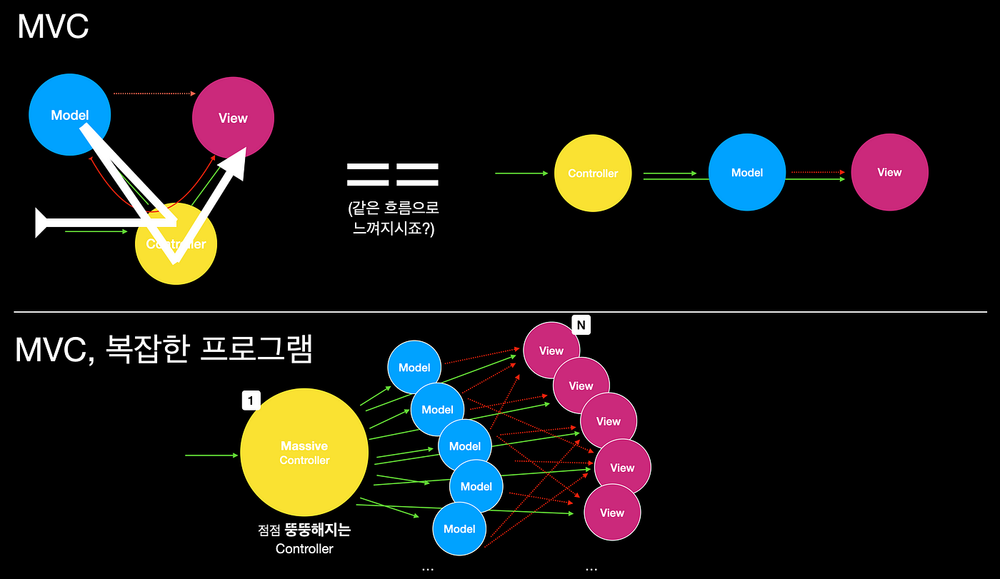
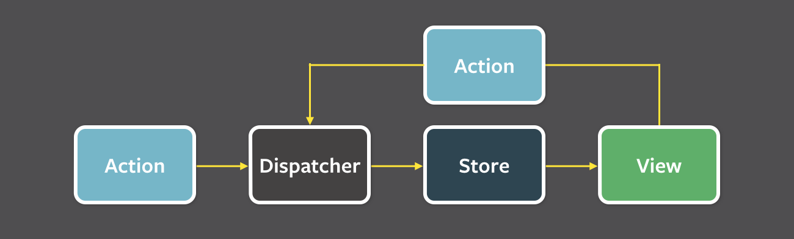

# 05장: 리액트와 상태 관리 라이브러리

## 5.1 상태 관리는 왜 필요한가?
상태로 관리해야할 것들이 현대 웹 애플리케이션에 오면서 많아짐.

### 5.1.1 리액트 상태 관리의 역사

[mvc_패턴](https://medium.com/@jang.wangsu/%EB%94%94%EC%9E%90%EC%9D%B8%ED%8C%A8%ED%84%B4-mvc-%ED%8C%A8%ED%84%B4%EC%9D%B4%EB%9E%80-1d74fac6e256)

리덕스 -> Context API -> 훅의 탄생, React Query, SWR -> Recoil, Zustand, 

## 5.2 리액트 훅으로 시작하는 상태 관리

### 5.2.1 가장 기본적인 방법: useState와 useReducer
`useState`, `useReducer` 지역상태 관리, 재사용은 가능하지만 여러 컴포넌트에서 사용하기에는 컴포넌트 트리를 재설계해야하는 수고로움 필요
### 5.2.2 지역 상태의 한계를 벗어나보자: useState의 상태를 바깥으로 분리하기
단순히 외부에서 상태를 참조하면 리액트에서 렌더링이 일어나지 않음. 아래 조건 필요

1. 컴포넌트 외부에 상태를 두고 여러 컴포넌트가 같이 쓸 수 있어야함.
2. 외부 상태를 사용하는 컴포넌트는 상태의 변화를 알아차리고 리렌더링을 trigger해야함. 리렌더링시에는 최신값으로. 상태를 참조하는 모든 컴포넌트에 동일하게 적용되야함.
3. 상태가 원시값이 아닌 객체일 때 내가 감시하는 값만 업데이트 되야함.

### 5.2.3 useState와 Context를 동시에 사용해 보기

### 5.2.4 상태 관리 라이브러리 Recoil, Jotai, Zustand 살펴보기

- `useState`, `useReducer`가 가지고 있는 한계, 지역상태를 극복하기 위해 외부 어딘가에 상태를 둔다.
- 이 외부 상태 변경을 감지해 렌더링을 일으킨다.

#### Recoil
아직도 실험버전... 2023 4월 마지막 업데이트...
#### Jotai
3주전 업데이트

상향식 접근법, 작은 단위의 상태를 위로 전파할 수 있다.

> Jotai takes an atomic approach to global React state management.
https://jotai.org/

> 👻 Primitive and flexible state management for React
#### Zustand
1주전 업데이트

A small, fast, and scalable bearbones state management solution. Zustand has a comfy API based on hooks. It isn't boilerplatey or opinionated, but has enough convention to be explicit and flux-like.

Don't disregard it because it's cute, it has claws! Lots of time was spent to deal with common pitfalls, like the dreaded zombie child problem, React concurrency, and context loss between mixed renderers. It may be the one state manager in the React space that gets all of these right.
> 🐻 Bear necessities for state management in React

가벼움

### 5.2.5 정리
