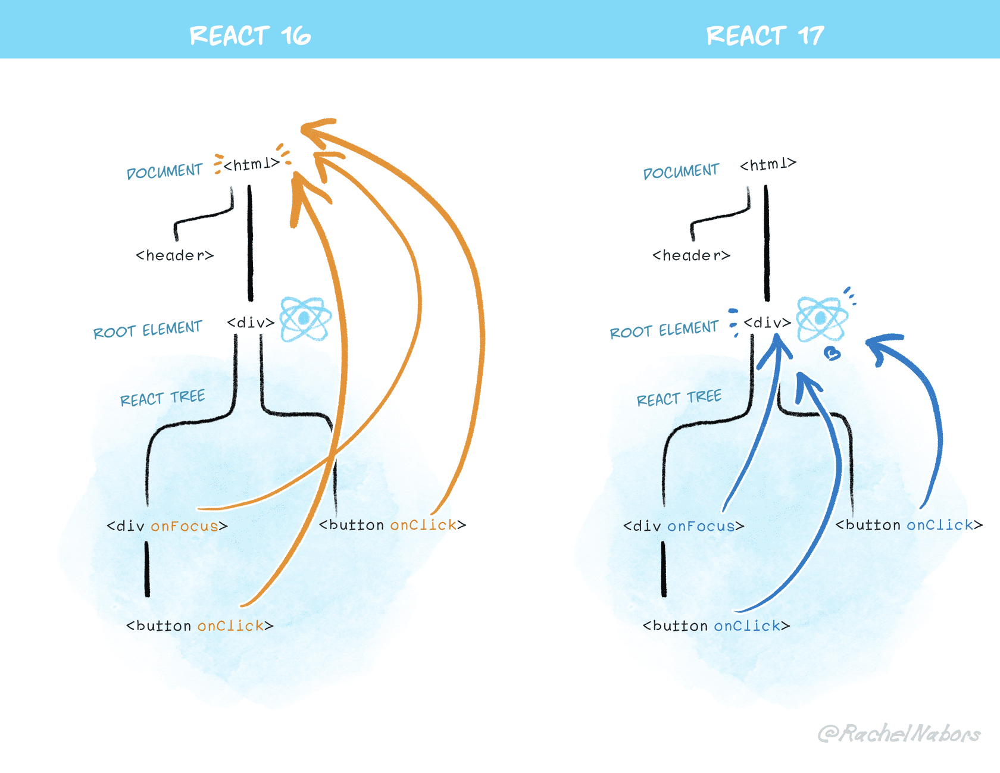

# 10장: 리액트 17과 18의 변경 사항 살펴보기

## 10.1 리액트 17 버전 살펴보기
### 10.1.1 리액트의 점진적인 업그레이드
### 10.1.2 이벤트 위임 방식의 변경

### 10.1.3 `import React from 'react'`가 더 이상 필요 없다: 새로운 JSX transform
### 10.1.4 그 밖의 주요 변경 사항
- 이벤트 풀링제거
- 16까지는 클린업 함수가 동기적으로 처리됨.
- 17부터 비동기적으로 실행됨
- 17부터 forwardRef, memo에서 undefined 반환해도 별다른 에러가 발생하지 않음
- 

### 10.1.5 정리
17는 사용자에게 영향을 미칠 수 있는 변화를 최소화

## 10.2 리액트 18 버전 살펴보기
동시성 지원
### 10.2.1 새로 추가된 훅 살펴보기
- useId
- useTransition
- useDeferredValue
- useSyncExternalStore
    document.body, window.innerWidth등 외부상태를 참고할 때는 테어링 현상 방지를 위해 필요
- useInsertionEffect
    useLayoutEffect보다 먼저 실행, css in js 등에서 사용

### 10.2.2 `react-dom/client`
### 10.2.3 `react-dom/server`
renderToPipeableStream
renderToReadableStream


### 10.2.4 자동 배치(Automatic Batching)
여러 상태를 하나의 리렌더링으로 묶어서 성능 향상

Promise, setTimeout같은 비동기이벤트에서도 자동배치 됨.

```jsx
function handleClick() {
    sleep(3000).then(()=> {
        setCount((c) => c + 1)
        setFlag(!f)
    })
}
```

### 10.2.5 더욱 엄격해진 엄격 모드

엄격모드에서 useEffect를 두번 실행하는 건 의도된 것.
함수형 철학을 지키는 지 검사하는 것.

-> useEffect를 사용할 때는 적절한 cleanup함수를 배치해 useEffect의 부수효과에서 자유로운 것이 중요


### 10.2.6 Suspense 기능 강화
### 10.2.7 인터넷 익스플로러 지원 중단에 따른 추가 폴리필 필요
### 10.2.8 그 밖에 알아두면 좋은 변경사항
### 10.2.9 정리
